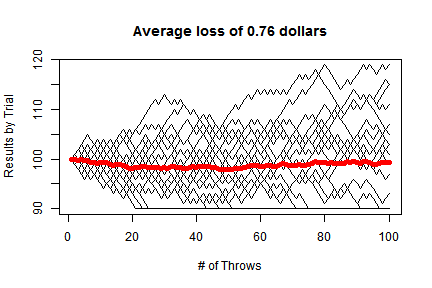

## The Game of Craps

* Craps, a popular casino game, consists of a wheel that displays numbers 1 through 37
* 18 of the numbers are red, 18 are black, and 1 is green
* In a game, the wheel is spun and a ball is thrown onto the wheel, and the number and corresponding color the ball settles on determines the outcome
* There are many strategies, but a popular one is to simply place a bet on whether the ball lands on a black or a red space
* In this strategy, if you bet X dollars and the ball lands on the color you predict, you win X dollars
* However if the ball lands on another color, you lose the X dollars you bet
* Thus the probability of winning in this strategy is 18/37

---

## Your Goal

* Being a savvy gambler, you know that since the odds of winning are less 50%, if you play enough games sequentially you should eventually lose all your money because of the law of large numbers
* However, you have heard of many betting "strategies" that people implement to try to beat the odds
* For instance in one strategy a gambler will bet a fixed amount, if they win they step away from the table and take their winnings, but if they lose they double the bet amount, and continue iteratively until they win
* Although due to the law of large numbers you aren't sure these strategies make sense, but you've also heard many casinos have banned them, so perhaps it's worth a shot!

---

## Your Plan

* You are also well versed in the world of trading stocks and know of a popular trading strategy to "limit losses and let gains ride"
* In this strategy you make many trades and on each one you set a maximum allowable loss on each trade before closing the trade
* You also set a maximum allowable gain, at which point you close the trade and take your profits
* Applying this to craps, you wonder if you can devise a strategy where you sit down at a craps table with a Max Loss and Max Gain that you allow yourself, and when you hit either level you stop playing and walk away

---

## Shiny App Simulation

* Although this seems like a good idea, as a programmer you also want to put your idea to the test in a computer simulation before putting your hard-earned money at risk!
* The simulation you devise is this: you visit the casino 25 times, each time starting with $100
* At each casino visit, you play up to 100 games, betting $1 in each game, and if you ever reach your Max Loss or Max Gain you step away from the table and stop playing for that casino visit
* Having determined this simulation, you set your sights on testing different Max Loss and Max Gain parameters
* The Shiny app performs this function exactly, given a Max Loss and Max Gain parameter it will simulate playing 25 games as described above, and show theoretical results so you can evaluate your parameter choices

---

## Example Output

 
* In the above chart, the x-axis is the game iteration for each visit to the casino, the y-axis shows your wealth for each visit, the thin black lines are each a simulation of a visit to the casino, and the thick red or green line show the average of the results across the 25 casino visits
* If your average casino visit resulted in a gain the line will be green, and if it resulted in a loss it will be red
